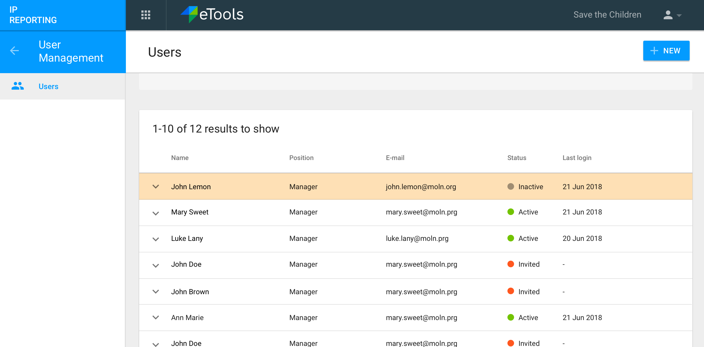

# Users screen

## **Adding new User**

Adding new user is possible by clicking button placed in the top right of this screen.

  
When button is clicked, following modal windows are displayed to the user:

  
If user already exists in data base, the following error message will be displayed. Saving changes and continuing is impossible.

When information is provided, user can press “save and continue” button which will take him to the next modal window, where permissions can be assigned to just added person:

Role of each user depends on the workspace. Logged in user can only assign roles for other users in workspaces, where he has a role of Authorized Officer or IP Admin.  
****

Authorized Officer will have the possibility to add a new CSO user as an IP Admin. IP Admin can designate access permission for the organization and add more users as IP Editors or IP Viewers.

## Filters

  
****On the top of the screen person can use filter area to narrow down search results that appear below.

## **Search results**

Below filters user can see search results in a form of a list of users. It contains columns:

* Name
* Position \(optional field\)
* E-mail
* Status \(Active or Invited or Inactive\) - Row will be highlighted if no role has been assigned to them.
* Last login

  
Each row in a table is expandable. By expanding a row, additional data is revealed. This data shows information about user’s permissions per workspace.

### Edit/delete/add new permission

**Depending on the role of logged in person, different actions can be taken here:**

* **As Authorized Officer** of particular workspaces, this person can make the user an IP Admin or can delete \(remove\) this role for this user in those workspaces. These actions are accessible by clicking on the links next to the Workspace/Role pair.
* If AO is logged in and there are other AO's in the system \(can re-use existing user list API endpoint with AO filter\) then at top of user list \(above filters\) show the names of those AO's and a link saying "see all below" which triggers the filter then.
* Also if role is AO a different color in the table row to make it stand out.
* Only Authorized officers from PMP will be synced and assign correct roles in the new ID management data models.
* AO of a workspace can remove AO role from another user in same workspace.

Both actions of making and removing a role of IP Admin will display modal window, so Authorized Officer will need to confirm this decision:

* **As IP Admin** of particular workspaces, this person can edit or delete roles for users in those workspaces. These actions are accessible by clicking on the links next to the Workspace/Role pair:

Editing a role takes place in a modal window:

  
For chosen workspace \(this field is not editable\), user can select different role and save changes.  

* **Both Authorized Officer and IP Admin** can add new permissions for the user. Clicking on “Add new permissions” button will display modal window:

User can select from workspaces he has access to.

### No permissions assigned

User with no permissions assigned is displayed in the UI as shown below:

### Information about other Authorized Officers

If user is logged in as an  AO and there are other AOs in his workspaces, information \(as shown below\) will be displayed:

  
Clicking on the button "Click here to see them" will filter search results.

##  

